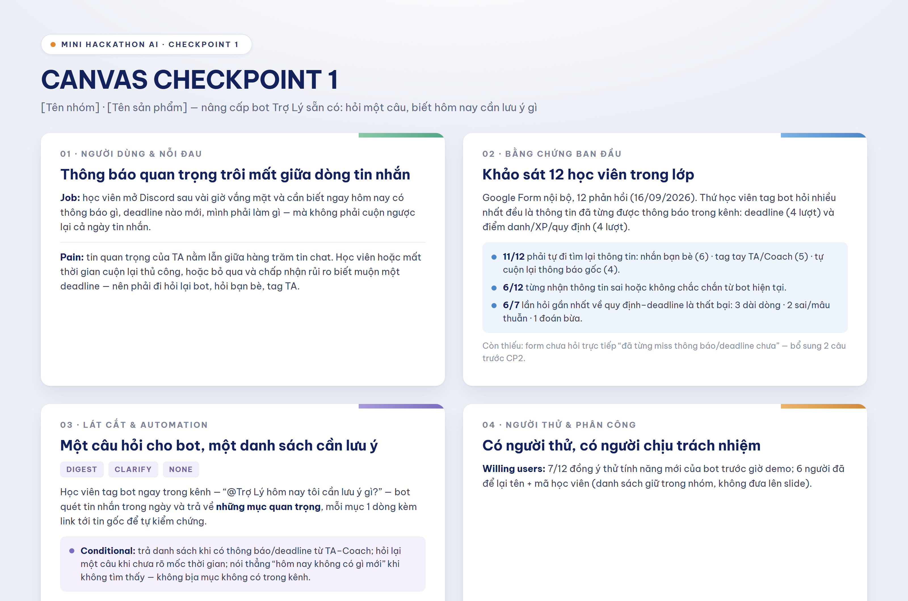

# K4-3A-E403-tripleT

## 👥 Danh sách thành viên & Phân chia công việc

| STT | Mã học viên | Họ và tên | Vai trò | Nhiệm vụ chính |
| :-: | :---: | :--- | :--- | :--- |
| 1 | `2A202602919` | **Phạm Minh Hiếu** | Team Leader | Khởi tạo repo, quản lý & cập nhật README, điều phối chung |
| 2 | `2A202602967` | **Nguyễn Việt Hoàng Hải** | Member | Nghiên cứu & suy đoán trước các pain points |
| 3 | `2A202602546` | **Nguyễn Thị Minh Khánh** | Member | Xây dựng kịch bản & bộ câu hỏi phỏng vấn |
| 4 | `2A202602421` | **Nguyễn Quang Huy** | Member | Trực tiếp thực hiện phỏng vấn & thu thập phản hồi |

---

### 📌 Chi tiết phân công nhiệm vụ (Role & Responsibilities) (CP1)

- **1. Phạm Minh Hiếu** (`2A202602919`)
  - **Vai trò**: Trưởng nhóm (Team Leader)
  - **Trách nhiệm**:
    - Khởi tạo GitHub repository cho dự án.
    - Cấu trúc, hoàn thiện và cập nhật tài liệu `README.md`.
    - Điều phối công việc và theo dõi tiến độ tổng thể của nhóm.

- **2. Nguyễn Việt Hoàng Hải** (`2A202602967`)
  - **Vai trò**: Thành viên (Problem & Pain Point Analyst)
  - **Trách nhiệm**:
    - Nghiên cứu, phân tích và suy đoán trước các pain points (điểm khó khăn / nỗi đau) của người dùng.
    - Xác định các giả định ban đầu cần kiểm chứng.

- **3. Nguyễn Thị Minh Khánh** (`2A202602546`)
  - **Vai trò**: Thành viên (Interview & Survey Designer)
  - **Trách nhiệm**:
    - Xây dựng kịch bản và chuẩn bị bộ câu hỏi phỏng vấn người dùng.
    - Đảm bảo câu hỏi bám sát các pain points cần làm rõ.

- **4. Nguyễn Quang Huy** (`2A202602421`)
  - **Vai trò**: Thành viên (Field Interviewer)
  - **Trách nhiệm**:
    - Trực tiếp tiếp cận đối tượng mục tiêu và tiến hành phỏng vấn.
    - Ghi nhận, tổng hợp thông tin phản hồi và insight thực tế từ người dùng.

---

## Canvas Checkpoint 1

---

## Sản phẩm — Trợ Lý Kute

**Tối ưu một lượt tương tác đã có** của bot Trợ Lý trong server lớp: học viên hỏi
*"những thông tin quan trọng tôi cần nắm là gì?"* → bot quét **mọi kênh người đó
có quyền đọc** (kể cả kênh đội/nhóm) trong **3 ngày gần nhất**, rồi **trả lời
riêng — chỉ người hỏi thấy** — danh sách mốc thời gian kèm link về tin gốc.

Không phải bot mới, không phải bảng tin, không tự đẩy tin định kỳ.

| Đọc gì | Ở đâu |
|---|---|
| **Hướng dẫn cho cả nhóm** (dự án là gì · cài đặt · cách chạy · câu hỏi hay bị hỏi) | [`huong-dan.md`](huong-dan.md) |
| **Spec đầy đủ** (§1–§9, bằng chứng, số đo) | [`spec.md`](spec.md) |
| Cách chạy, luồng xử lý, phần nào thật phần nào mock | [`codebase/README.md`](codebase/README.md) |
| Bộ 25 test case + đáp án dán tay | [`eval/test-cases.json`](eval/test-cases.json) · [`eval/golden-set.json`](eval/golden-set.json) |
| Kết quả hai lượt đo | [`eval/ket-qua-luot-1.md`](eval/ket-qua-luot-1.md) (đã khoá) · [`eval/ket-qua-luot-2.md`](eval/ket-qua-luot-2.md) |
| **Slide pitch 6 trang** | [`demo-slides.pdf`](demo-slides.pdf) — nguồn: [`design/demo-slides.html`](design/demo-slides.html) |
| Kịch bản quay video demo dự phòng | [`design/kich-ban-video-cp5.md`](design/kich-ban-video-cp5.md) |
| Cho người ngoài dùng thử (R6) | [`validation/`](validation/) |
| Reflection cá nhân | [`reflection/`](reflection/) |

Ba con số nói vì sao làm như vậy — đều đếm từ data thật BTC cấp (1.092 tin, 3 ngày):

- **85%** học viên (171/201) chỉ xuất hiện ở đúng **một** kênh → một bản tin chung
  không thể đúng cho tất cả, câu trả lời phải bám theo kênh của từng người.
- **88%** số chữ trong kênh đông nhất là do bot đăng công khai → trả lời riêng là
  cách duy nhất vừa trả lời đủ, vừa không làm loãng kênh lớp.
- **2/5** mốc còn hiệu lực tính đến hết 14/09 lại được đăng từ ngày hôm trước →
  phạm vi "trong ngày" bỏ sót 40%, nên cửa sổ phải là 3 ngày.

> Dữ liệu pack của BTC **không** nằm trong repo này (`.gitignore` chặn sẵn) theo
> quy định bảo mật. Mọi chỗ dẫn chứng chỉ ghi mã tin `M#####`.
